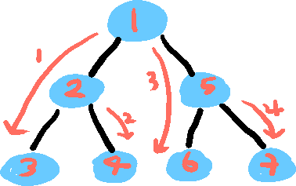
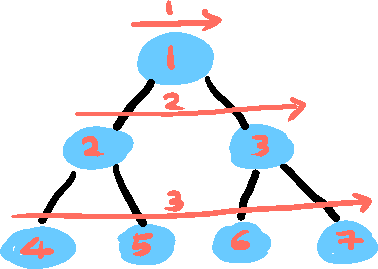

## DFS/BFS

: 그래프 탐색 알고리즘

---
### DFS (깊이 우선 탐색)

<b>문제 예시</b>
- 조건에 맞는 모든 경우의 수를 찾는 브루트 포스 문제

<b>구현 방법</b>
- Stack 또는 재귀 함수를 통해 구현
- 방문 처리를 통해 이미 방문한 노드는 Stack에 넣지 않는다.
---
### BFS (너비 우선 탐색)

<b>문제 예시</b>
- 특정 경로로 가는 최단 경로를 찾는 문제

<b>구현 방법</b>
- Queue를 이용해 구현
- 방문 처리를 통해 이미 방문한 노드는 Queue에 넣지 않는다.
- 목적지를 찾으면 바로 리턴한다.